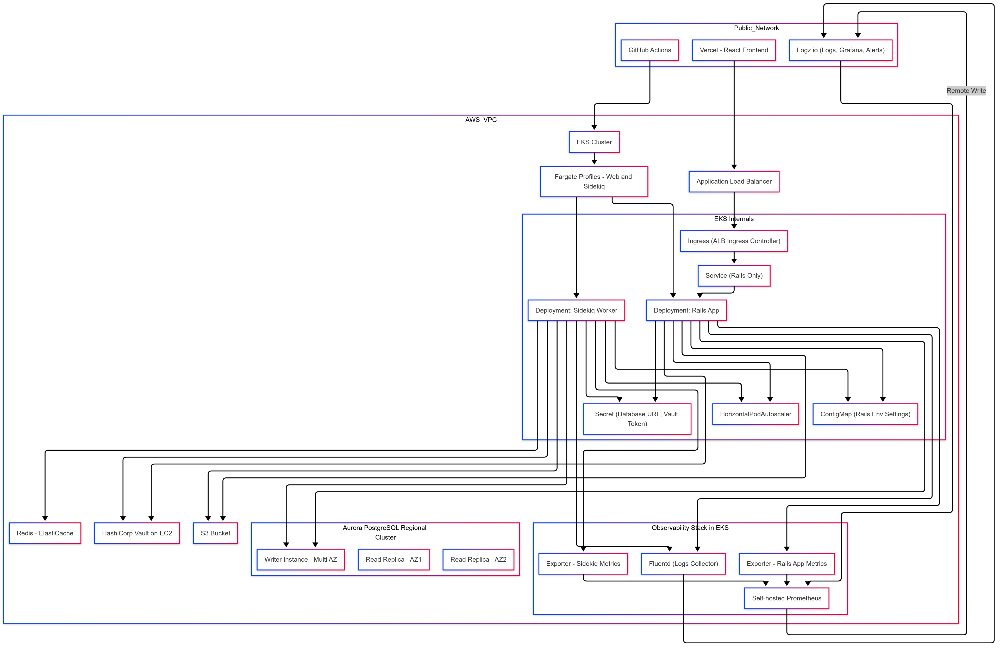

# Soraban: Heroku to AWS Migration Plan

## 📚 Table of Contents

- [📌 Overview](#-overview)
- [🎯 Objectives](#-objectives)
- [⚙️ Architecture Overview](#️-architecture-overview)
- [🧱 Infrastructure Components & Justification](#-infrastructure-components--justification)
  - [✅ AWS EKS on Fargate](#-aws-eks-on-fargate)
  - [✅ Aurora PostgreSQL (Regional, Fargate)](#-aurora-postgresql-regional-fargate)
  - [✅ HashiCorp Vault on EC2](#-hashicorp-vault-on-ec2)
  - [✅ Prometheus + Fluentd + Logz.io](#-prometheus--fluentd--logzio)
  - [✅ S3](#-s3)
  - [✅ GitHub Actions](#-github-actions)
  - [✅ Redis (for Sidekiq)](#-redis-for-sidekiq)
  - [🧠 Aerospike (Optional - Future Use)](#-aerospike-optional---future-use)
- [🛡️ Security & SOC 2 Alignment](#️-security--soc-2-alignment)
- [💸 Cost Estimate (Rough, per month)](#-cost-estimate-rough-per-month)
- [📈 Scalability Plan](#-scalability-plan)
- [🚧 Future Enhancements](#-future-enhancements)
- [🧪 Migration Approach](#-migration-approach)
- [✅ Summary](#-Summary)

## 📌 Overview

This document outlines a proposed migration of Soraban's Ruby on Rails backend from Heroku to AWS. The goal is to improve availability, performance, scalability, and cost-efficiency while preparing the platform for future growth and SOC 2 compliance.

---

## 🎯 Objectives

- Migrate Rails & Sidekiq workloads to AWS with no major downtime
- Introduce scalable infrastructure optimized for seasonal traffic spikes
- Lock down production data access, meeting SOC 2 requirements
- Replace opaque PaaS services with observable, open systems
- Provide a clean DevOps foundation for a growing engineering team

---

## ⚙️ Architecture Overview

 <!-- Link to Mermaid if rendering supported -->

- **VPC**: Isolated network for all workloads
- **EKS (Fargate)**: Manages Rails app and Sidekiq workers in a scalable, serverless way
- **Aurora PostgreSQL (Fargate, Regional)**: HA, autoscaling database with writer and read replicas
- **Vault on EC2**: Secure secrets management
- **Prometheus + Fluentd**: Collect metrics and logs from containers
- **Logz.io**: Unified observability (metrics, logs, alerting via Grafana)
- **S3**: Stores static assets, file uploads
- **GitHub Actions**: CI/CD pipelines
- **Ingress (ALB Controller)**: HTTP traffic routing

---

## 🧱 Infrastructure Components & Justification

### ✅ AWS EKS on Fargate
- **Why**: Serverless Kubernetes removes need to manage EC2 nodes.
- **Benefits**: Per-pod billing, seamless auto-scaling, integrated IAM & security policies.
- **Compared to**: ECS is less flexible for future multi-region workloads or if a service mesh is introduced.

### ✅ Aurora PostgreSQL (Regional, Fargate)
- **Why**: Managed PostgreSQL with horizontal read scaling and high availability.
- **Benefits**: Auto-scaling replicas, automatic backups, no manual tuning.
- **Compared to RDS**: Lower TCO at scale, built-in fault tolerance, and faster recovery.

### ✅ HashiCorp Vault on EC2
- **Why**: Full control over secrets, encryption, and auditing.
- **Benefits**: Meets SOC 2 requirements, easy GitHub Actions integration, dynamic DB credentials.
- **Compared to SSM Parameter Store / Secrets Manager**: Vault gives fine-grained access control and better integration with Kubernetes.

### ✅ Prometheus + Fluentd + Logz.io
- **Why**: Open-source observability pipeline with centralized dashboards and alerts.
- **Benefits**:
  - Prometheus scrapes metrics (Sidekiq + Rails exporters)
  - Fluentd collects logs from all pods and sends to Logz.io
  - Logz.io provides managed Grafana + alerting + anomaly detection
- **Compared to CloudWatch/Sentry**: More transparent, customizable, and avoids vendor lock-in.

### ✅ S3
- **Why**: Low-cost, reliable object storage.
- **Use**: Replaces Heroku-hosted assets and user-generated file uploads.

### ✅ GitHub Actions
- **Why**: Native CI/CD, already in use by the team.
- **Use**: Builds Docker images, deploys to EKS, syncs with Vault.

### ✅ Redis (for Sidekiq)
- **Why**: Sidekiq requires Redis for job queueing.
- **Deployment**: Use AWS ElastiCache (Redis) or self-hosted Redis on EKS.
- **Benefits**:
  - Native Sidekiq support
  - Fast, in-memory performance
  - Supports HPA scaling by queue depth metrics

### 🧠 Aerospike (Optional - Future Use)
- **Why**: Ideal for large-scale, durable, low-latency key-value workloads.
- **Not used for Sidekiq**, but may be introduced for:
  - Session storage
  - High-scale caching
  - Analytics deduplication
- **Deployment Options**:
  - Self-hosted StatefulSet in EKS
  - Aerospike Cloud (fully managed)
  
---

## 🛡️ Security & SOC 2 Alignment

| Control Area | Implementation |
|--------------|----------------|
| **Data Access** | Developers use staging copies; production secrets are encrypted in Vault |
| **Secrets Management** | Vault issues short-lived tokens; no static secrets in source |
| **Audit Logging** | Vault audit logs + Logz.io alerts for production access |
| **Least Privilege** | IAM roles per pod (via IRSA), Vault policies scoped to environments |
| **Disaster Recovery** | Aurora automated backups + manual Vault snapshot rotation |
| **CI/CD Hardening** | GitHub OIDC tokens used to access AWS, no long-lived credentials |
| **Monitoring & Alerting** | Prometheus alert rules routed to Logz.io / PagerDuty |
| **Multi-Tenant Isolation** | Kubernetes namespaces separate non-prod and prod workloads |

---

## 💸 Cost Estimate (Rough, per month)

| Component                    | Service Type                  | Estimate (USD/month) |
|-----------------------------|-------------------------------|----------------------|
| EKS Control Plane (Fargate) | 1 cluster                     | $73                  |
| Fargate compute             | ~400 vCPU hours               | $150–250             |
| Aurora PostgreSQL (Regional, Fargate) | 1 writer, 2 readers   | $450–600             |
| Vault on EC2                | t3.medium + EBS + backup      | $45–70               |
| S3                          | 50 GB + PUT/GET traffic       | $5–10                |
| Logz.io (Standard plan)     | Logs (30 GB/day) + metrics    | $300–500             |
| Prometheus (self-hosted)    | EBS + minor EC2 usage         | $10–25               |
| Fluentd                     | Fargate or small EC2          | $10–25               |

**Total**: **~$1,100–1,500/month**  
(Reduces significantly in off-peak season due to Fargate scaling)

---

## 📈 Scalability Plan

- EKS with Fargate profiles supports horizontal scaling on demand.
- Sidekiq workers scale based on job queue length via HPA.
- Aurora auto-scales read replicas during traffic spikes.
- All services support future multi-region expansion with minimal rework.

---

## 🚧 Future Enhancements

- Add Redis (ElastiCache) for Sidekiq job buffering.
- Use Karpenter or EC2-based node groups for cost tuning long term.
- Implement Terraform Cloud for remote state management and change review.
- Apply OPA/Gatekeeper for Kubernetes policy enforcement.

---

## 🧪 Migration Approach

1. Stand up infrastructure via Terraform (see `/infra/`)
2. Containerize Rails app + Sidekiq with unified entrypoint
3. Deploy to staging namespace in EKS
4. Copy anonymized data from prod → staging
5. Load-test against new system
6. Cut over traffic gradually via DNS
7. Decommission Heroku dynos and RDS

---

## ✅ Summary

This design balances performance, cost, and compliance. By using Fargate and managed services where it counts, and introducing open observability and secure secrets handling, Soraban is well-positioned for growth, security audits, and engineering velocity.